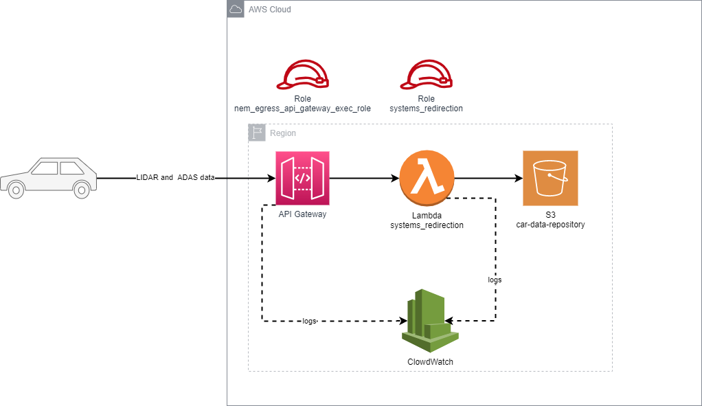
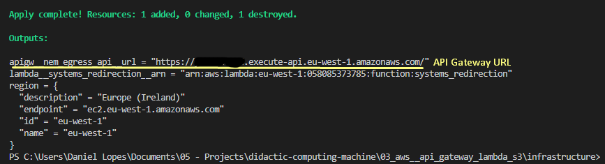
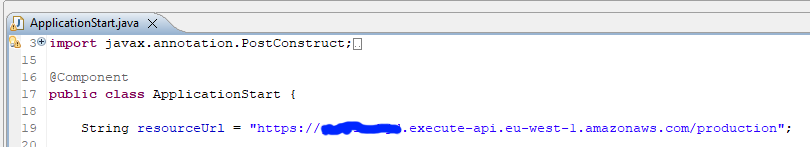
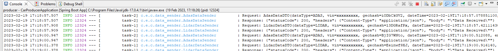

# Introduction to Amazon Web Services and Terraform

## Description
This project is related with article [Introduction to Amazon Web Services and Terraform](https://danieljalopes.hashnode.dev/introduction-to-amazon-web-services-and-terraform) where it is explained how to create infrastructure on Amazon Web Services (AWS) with Terraform.

The project consists in a Spring application simulating a car sending data to aws, store it in a S3 bucket and create all related logs.

## How to run
### Deploy infrastructure
1. Setup credentials in local machine in order to be able to apply the infrastructure. How to do that is out of scope, but there are plenty of resources on internet.
2. Open a command line terminal on folder infrastrucure.
3. Enter 'terraform apply' and then 'yes' and wait.
4. When the process ends, take note of API Gateway URL on output variable 'api__nem_egress_api__url', because is the url for the car simulator to send data.

### Run car simulator
1. Open your IDE of choice on folder 'apps/producer'
2. Open class ApplicationStart and update variable resourceUrl with the value of 'api__nem_egress_api__url' obtained previously.

3. To run the application from the command line on apps/producer, run './gradlew bootRun' and will appear on the command line output logs. Or just start it from your IDE.

# References
[AWS Lambda Developer Guide](https://docs.aws.amazon.com/pdfs/lambda/latest/dg/lambda-dg.pdf#example_cross_AuroraRestLendingLibrary_section) 